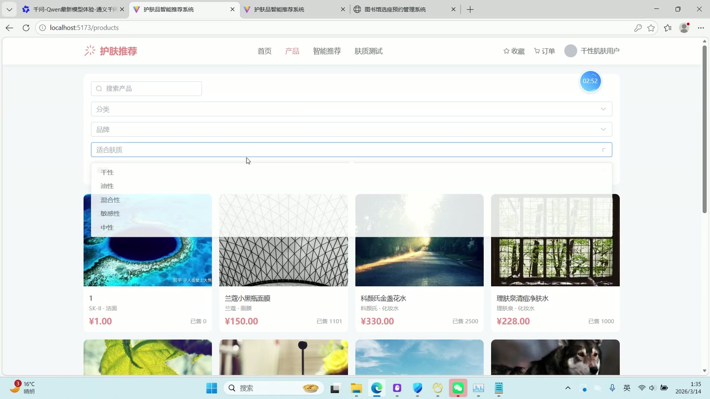
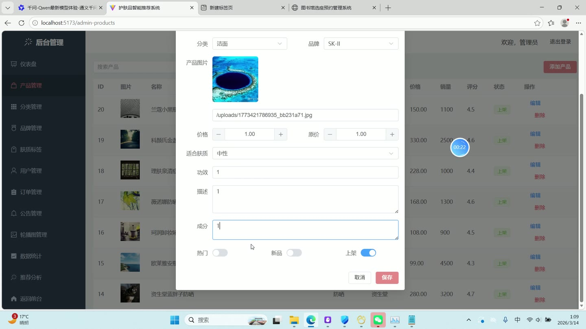
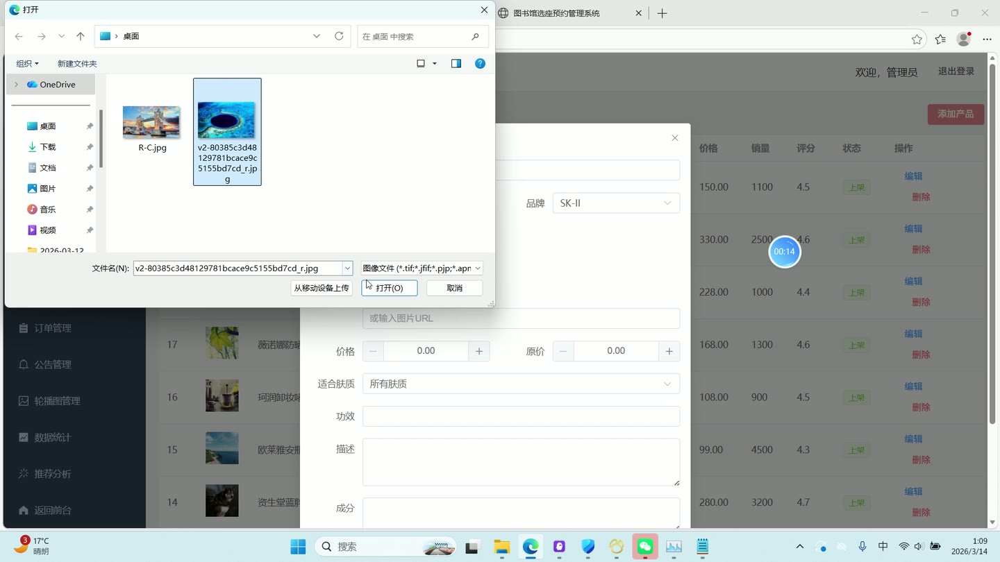
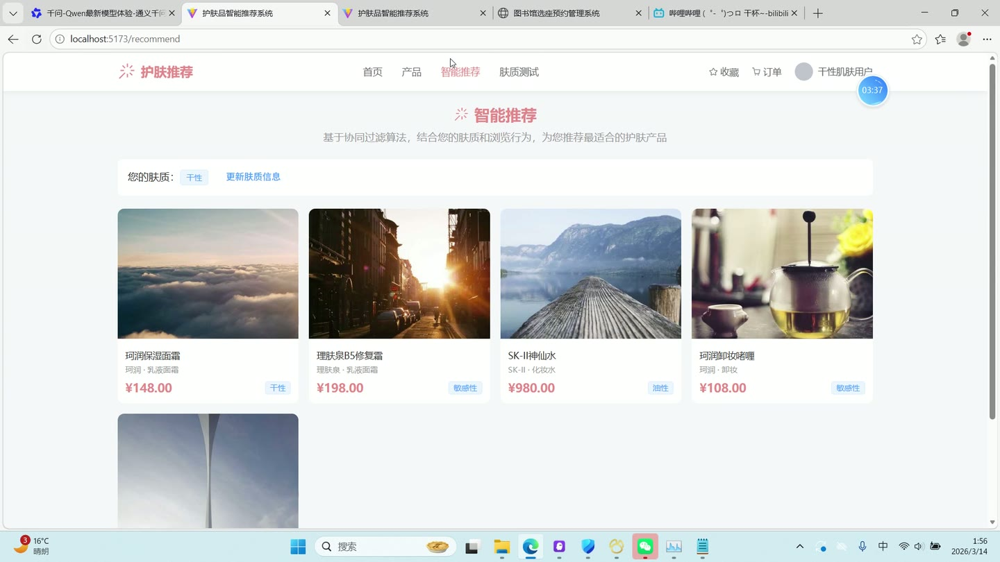
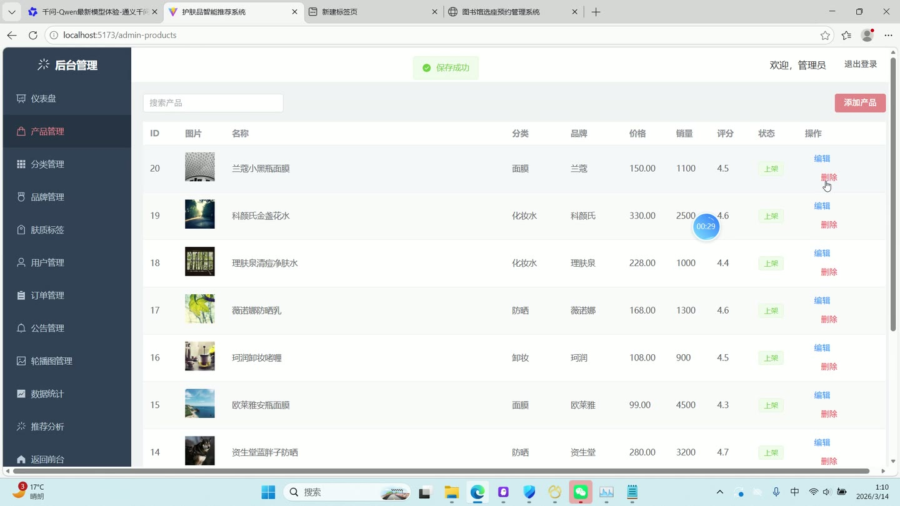
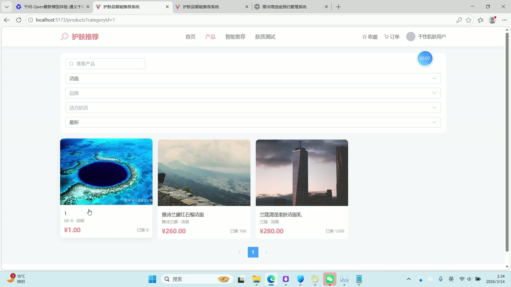

# (附文档)Python+Django+Vue3 基于协同过滤的护肤产品推荐系统

**技术栈**：Python、Django、机器学习、Vue3

### 系统简介

本系统是一套基于协同过滤算法的护肤产品推荐平台，采用前后端分离架构，后端基于 Django REST Framework 提供接口，前端使用 Vue3 构建单页应用。系统包含普通用户与管理员两类角色，覆盖产品浏览、智能推荐、肤质测试、收藏下单及后台数据管理等完整业务链路。
 
### 核心功能
 
### 普通用户端

 
- 注册账号：填写用户名、昵称、密码与确认密码，校验两次密码一致后提交注册。 
- 登录系统：输入用户名与密码，登录成功后按角色跳转至前台首页或后台仪表盘。 
- 首页浏览：查看轮播图、滚动公告、产品分类导航、热门推荐与新品上市四个板块。 
- 产品列表筛选：支持按关键词搜索，并按分类、品牌、适合肤质进行筛选。 
- 产品排序：支持按最新、价格升序、价格降序、销量、评分五种方式排序。 
- 产品详情查看：展示产品图片、品牌、分类、价格、原价、规格、功效、评分、销量与肤质标签。 
- 功效评分查看：在详情页切换功效评分标签，以进度条形式展示各功效维度得分。 
- 相似产品推荐：详情页底部展示基于相似度计算出的相关产品列表。 
- 收藏与取消收藏：点击收藏按钮切换收藏状态，收藏状态实时回显。 
- 我的收藏列表：分页查看已收藏产品，点击卡片跳转至对应详情页。 
- 智能推荐：基于协同过滤算法结合用户肤质与浏览行为生成个性化推荐列表。 
- 肤质测试：回答四道肤质测试题，系统按选项统计得出肤质类型并给出护理建议。 
- 保存肤质信息：测试完成后可将肤质类型保存至个人资料并跳转推荐页。 
- 立即购买下单：在详情页直接下单，生成订单并跳转至我的订单页面。 
- 我的订单管理：分页查看订单号、商品明细、总金额、状态与下单时间。 
- 订单操作：对待付款订单执行付款或取消，对已付款/已发货订单执行确认收货。 
- 模拟付款：弹窗选择微信支付或支付宝后确认付款，订单状态更新为已付款。 
- 个人资料维护：修改昵称、头像、邮箱、手机号、性别、年龄、肤质与肌肤问题。 
- 修改密码：在个人中心填写新密码，留空则不修改。 
- 浏览行为记录：进入产品详情页时自动上报浏览行为，作为推荐算法数据来源。
 
### 管理员端

 
- 后台仪表盘：查看系统核心统计概览数据。 
- 用户管理：按关键词与角色筛选用户列表，支持分页查看与删除用户。 
- 分类管理：新增、编辑、删除产品分类，维护分类名称、图标、排序与状态。 
- 品牌管理：按关键词搜索品牌，新增、编辑、删除品牌并维护 Logo、国家与描述。 
- 肤质标签管理：新增与删除肤质标签，维护标签名称、类型与描述。 
- 产品管理：新增、编辑、删除护肤产品，维护名称、分类、品牌、价格、原价、规格、成分、功效、适合肤质、库存、评分与销量。 
- 产品图片维护：上传产品主图并维护产品图片集。 
- 产品标签绑定：为产品关联多个肤质标签。 
- 产品状态控制：设置产品上架状态、热门标记与新品标记。 
- 订单管理：查看全部订单并按状态更新订单状态。 
- 公告管理：新增、编辑、删除公告，维护标题、内容与显示状态。 
- 轮播图管理：新增、编辑、删除轮播图，维护图片、链接、排序与显示状态。 
- 产品统计：查看产品维度的统计数据。 
- 推荐统计：查看推荐算法相关的统计数据。 
- 文件上传：通过统一上传接口上传图片等资源文件。
 
### 技术栈

 后端框架Python + Django + Django REST Framework 推荐算法协同过滤（基于用户行为与相似度计算） ORMDjango ORM（含 select_related / prefetch_related 关联查询） 权限与认证自定义 MD5 密码加密 + 角色字段区分普通用户与管理员 + 前端路由守卫 前端框架Vue3（组合式 API） UI 组件库Element Plus 状态管理Pinia 前端路由Vue Router（createWebHistory） 构建工具Vite 样式方案SCSS（scoped） 数据库关系型数据库，表前缀 tb_（用户、分类、品牌、肤质标签、产品、产品功效、用户行为、收藏、订单、订单项、公告、轮播图）
 
### 交付内容

 
- 后端完整源码 
- 前端完整源码 
- 数据库初始化脚本 
- 万字文档

## 界面展示

---

## 获取完整源码 + 万字文档

本仓库为项目介绍页。**完整前后端源码、数据库初始化脚本、万字项目文档**，请加微信 `kangkangcode`，或访问 [codekk.top](http://codekk.top) 获取。

可作课程设计 / 毕业设计参考，支持远程部署调试。